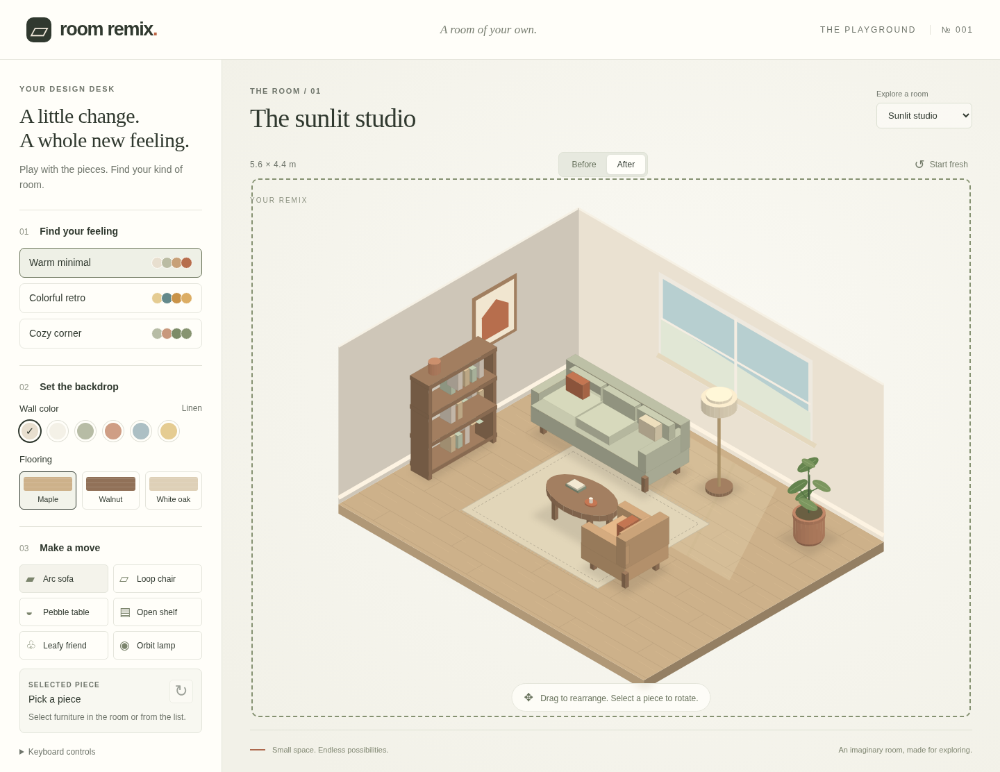

# Room Remix

A tiny, interactive interior-design playground. Rearrange a sunlit studio or a little bedroom, try a different palette, and compare your room with its original layout.



## What you need

- Git.
- Python 3.10 or newer.
- A current browser, such as Chrome, Edge, Firefox, or Safari.

Everything else is included. There are no packages to install, accounts to create, or API keys to configure. After cloning, the demo works offline.

Check your setup before the session:

| | macOS / Linux | Windows PowerShell |
|---|---|---|
| Git | `git --version` | `git --version` |
| Python | `python3 --version` | `py -3 --version` |

If either command is missing, install [Git](https://git-scm.com/downloads) or [Python](https://www.python.org/downloads/) first. Git and Python are explicit prerequisites; they may not already be installed on your laptop. On Windows, the Python installer should enable the `py` launcher. If you have a working `python --version` showing Python 3.10+, you can use `python` instead of `py -3` below.

## Launch the playground

Open a terminal. On Windows, PowerShell is fine. Clone this repository and enter its folder:

```sh
git clone https://github.com/Dream-Technologies/room-remix.git
cd room-remix
```

**macOS / Linux**

```sh
python3 demo.py
```

**Windows PowerShell**

```powershell
py -3 demo.py
```

Your browser opens automatically. If it doesn't, open the `http://127.0.0.1:...` link printed in the terminal. Keep that terminal running while you explore.

## Make yourself at home

1. Drag furniture to rearrange the room. Pieces stay inside the room.
2. Select a piece and click the rotate button, or press **R**.
3. Choose **Warm minimal**, **Colorful retro**, or **Cozy corner**. A style changes the room's palette and materials while preserving your furniture positions.
4. Try a wall color, flooring, or a selected piece's fabric or finish.
5. Switch between **Before** and **After**. Before shows the original room; After preserves your design and lets you keep editing.
6. Try the bedroom from the room selector. **Start fresh** resets the current room.

For keyboard controls, select a piece from the furniture list, then use the **arrow keys** to nudge it along the room's axes. Hold **Shift** for bigger steps. Press **R** to rotate or **Escape** to deselect. The controls also work with touch.

Your design lives in this browser tab. Refreshing, switching rooms, or starting fresh resets it. This is a playful design sketch, with free placement inside the room; it doesn't check furniture collisions or building requirements.

## Try another command

First stop the program with **Ctrl+C** in the terminal. Then launch the bedroom:

```sh
# macOS / Linux
python3 demo.py --room tiny-bedroom
```

```powershell
# Windows PowerShell
py -3 demo.py --room tiny-bedroom
```

You can also discover the available options:

```sh
python3 demo.py --help
```

On Windows, use `py -3 demo.py --help`.

| Option | What it does |
|---|---|
| `--room studio` | Opens the sunlit studio (the default). |
| `--room tiny-bedroom` | Opens the bedroom. |
| `--no-browser` | Prints the link without opening a browser. |
| `--port 8000` | Uses a specific local port. By default, the launcher finds an available port. |

When you're finished, press **Ctrl+C** in the terminal to stop the program. No source-file changes, commits, or submissions are required to explore the demo.

## If something doesn't work

- **Command not found:** check the prerequisites above. Try `py -3` or a verified Python 3 `python` command on Windows.
- **Can't open `demo.py`:** run the command from the `room-remix` folder. Check your location with `pwd` in macOS, Linux, or PowerShell. Use `ls` to see the files.
- **Browser didn't open:** copy the complete link printed in the terminal into a browser on the same laptop.
- **Port already in use:** launch without `--port` to automatically choose an available port.
- **Room stopped responding:** make sure the terminal is still running the program, then refresh the browser.

## What's inside

```text
room-remix/
  START_HERE.md       This guide
  demo.py             Python standard-library launcher and local server
  dist/
    index.html        Design desk and semantic controls
    styles.css        Responsive layout
    app.js            Canvas geometry and interactions
  docs/
    room-remix.png    Screenshot of the demo
  tests/
    test_launcher.py  Standard-library launcher checks
  LICENSE             MIT
```

The floorplans, dimensions, palettes, and geometric furniture are invented specifically for this demo. The rendering and interactions are implemented independently. This repository contains no production app code, real catalog assets, customer projects, private datasets, or internal design algorithms. It makes no network requests after the page loads from the local server and uses no analytics or external assets.

For contributors, run the launcher checks with `python3 -m unittest discover -s tests -v` (Windows: `py -3 -m unittest discover -s tests -v`). Optional browser-agent hooks use feature detection and don't affect regular browsers.
